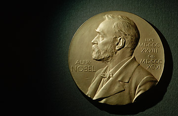

# Visualizing-the-History-of-Nobel-Prize-Winners_2020

Explore a dataset containing a century's worth of Nobel Laureates. Who won? Who got snubbed?

<h2> I'm trying to answer these business questions: </h2>

<ul>
  <li>What is the most commonly awarded gender and birth country?</li>
  <li>Which decade had the highest ratio of US-born Nobel Prize winners to total winners in all categories?</li>
  <li>Which decade and Nobel Prize category combination had the highest proportion of female laureates?</li>
  <li>Who was the first woman to receive a Nobel Prize, and in what category?</li>
  <li>Which individuals or organizations have won more than one Nobel Prize throughout the years?</li>
</ul>

## 🛠️ Tech Stack

-  **Programming Language:** Python 
- **Notebooks:** Colab, Datalab   
- **Data Visualization:** Seaborn,  matplotlib (Pyplot)  
-  **Data Manipulation:** Pandas, Numpy  

---

## 🙏 Acknowledgments
- DataCamp for the project inspiration.

---

## 📄 Appendix

This project is the first in the Associate Data Scientist in Python (DataCamp) career track. Feel free to ask me about any part of the code or the dataset details via email: [aelafifi00@gmail.com](mailto:aelafifi00@gmail.com).

---
